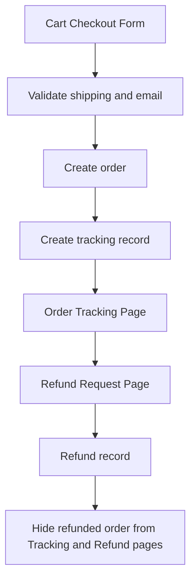

# Online Business Core Functions

This repository contains the core source-code references for an online business website developed for **NIT3114 Online Business System Development**.

The live site is implemented with custom WordPress/PHP code. For assignment citation and GitHub readability, the three main business functions have been separated into smaller reference files with neutral names.

## Project Information

- Project name: **Online Bicycle Shopping Platform**
- Course: **NIT3114 Online Business System Development**
- Group: **Group 26**
- Members:
  - Feng Kangle — `s8117872`
  - Zhang Xinshun — `s8118386`
- Website URL: `http://shopnest.atspace.cc`

## Core Business Functions

Assignment 1 defined three business functions. Assignment 2 implements these functions in the WordPress site.

| Business Function | Reference File | Description |
|---|---|---|
| Process Order Payment | `payment-core.php` | Validates checkout information, creates paid orders, stores shipping details, and creates initial logistics records. |
| Track Order | `tracking-core.php` | Shows current user's order tracking data, carrier, tracking number, status timeline, and hides refunded orders. |
| Request Return / Refund | `refund-core.php` | Allows users to submit refund requests, prevents duplicate refunds, and removes refunded orders from available lists. |

## Source File Mapping

The production site still runs from the main integrated plugin file in the site root.

The extracted reference files are mapped from these sections:

| Extracted File | Source Area in the main plugin file |
|---|---|
| `payment-core.php` | checkout and order creation logic |
| `tracking-core.php` | order tracking page and user order filtering |
| `refund-core.php` | refund page and refund submission logic |

## Data Flow

## Database Tables

The implementation uses three main custom WordPress database tables:

| Table | Purpose |
|---|---|
| `business_orders` | Stores order number, user ID, cart payload, payment method, payment status, and total amount. |
| `business_tracking` | Stores carrier, tracking number, logistics status, and timeline events. |
| `business_refunds` | Stores refund request, refund type, reason, evidence, status, and user ownership. |

## Implementation Notes

- The three business functions are implemented by custom PHP code instead of third-party WordPress plugins.
- The code runs inside WordPress and uses WordPress APIs such as AJAX actions, nonce verification, sanitization, current user identity, and database access through `$wpdb`.
- Order, tracking, and refund data are isolated by current logged-in user.
- Refunded orders are excluded from both the refund page and the order tracking page.
- Shipping email is required and validated during checkout.
